# Daily Reflection Tree — Visual Logic Map

Mermaid diagram of every node and branch in `reflection-tree.json`.
All 35 nodes are represented. Decision nodes (diamonds) are invisible
to the user — they set axis state and auto-advance.

```mermaid
graph TD
    START([start]) --> Q_ENERGY[q_energy_check]

    %% ── AXIS 1: LOCUS ──────────────────────────────────────
    Q_ENERGY -->|Exhausting / Frustrating / Steady| Q_FRICTION[q_locus_friction]
    Q_ENERGY -->|Productive| Q_IMPACT[q_locus_impact]

    Q_FRICTION -->|Figure out what I could control / Adapt| D_VICTOR{d_locus_victor}
    Q_FRICTION -->|Feel frustrated / Wait and see| D_VICTIM{d_locus_victim}

    Q_IMPACT -->|Prepared well / Adapted quickly / Team came through| D_VICTOR
    Q_IMPACT -->|Timing just worked out| D_VICTIM

    D_VICTIM --> R_VICTIM[r_locus_victim]
    D_VICTOR --> R_VICTOR[r_locus_victor]

    R_VICTIM --> Q_CHOICE[q_locus_choice]
    R_VICTOR --> BRIDGE1[bridge_locus_orientation]

    Q_CHOICE -->|Yes — could have responded differently| D_CHOICE_VICTOR{d_locus_choice_victor}
    Q_CHOICE -->|Not really / Maybe| D_CHOICE_VICTIM{d_locus_choice_victim}

    D_CHOICE_VICTOR --> R_CHOICE_VICTOR[r_locus_choice_victor]
    D_CHOICE_VICTIM --> R_CHOICE_VICTIM[r_locus_choice_victim]

    R_CHOICE_VICTOR --> BRIDGE1
    R_CHOICE_VICTIM --> BRIDGE1

    %% ── AXIS 2: ORIENTATION ─────────────────────────────────
    BRIDGE1 --> Q_FOCUS[q_orientation_focus]

    Q_FOCUS -->|Effort noticed / Focused on own list| Q_ENTITLE[q_entitlement_check]
    Q_FOCUS -->|Moved team forward / Looking for useful| Q_CONTRIB[q_contribution_check]

    Q_ENTITLE -->|Deserved more support / Others not pulling weight| D_ENTITLED{d_orientation_entitled}
    Q_ENTITLE -->|Looked for ways to adjust| Q_EXTRA_O[q_orientation_extra]

    Q_CONTRIB -->|Yes — felt like the right thing| D_CONTRIBUTOR{d_orientation_contributor}
    Q_CONTRIB -->|Fair trade| Q_EXTRA_O
    Q_CONTRIB -->|Thought about it but didn't act| D_ENTITLED

    Q_EXTRA_O -->|Work recognized and valued| D_ENTITLED
    Q_EXTRA_O -->|Work actually helped someone| D_CONTRIBUTOR

    D_ENTITLED --> R_ENTITLED[r_orientation_entitled]
    D_CONTRIBUTOR --> R_CONTRIBUTOR[r_orientation_contributor]

    R_ENTITLED --> BRIDGE2[bridge_orientation_radius]
    R_CONTRIBUTOR --> BRIDGE2

    %% ── AXIS 3: RADIUS ──────────────────────────────────────
    BRIDGE2 --> Q_SCOPE[q_radius_scope]

    Q_SCOPE -->|Clear own backlog| Q_NARROW[q_radius_narrow]
    Q_SCOPE -->|Colleague / User / Mission| Q_WIDE[q_radius_wide]

    Q_NARROW -->|What's next on my list| Q_EXTRA_R[q_radius_extra]
    Q_NARROW -->|Person receiving useful / Moved needle for team| D_ALTRO{d_radius_altro}

    Q_WIDE -->|Just me| D_SELF{d_radius_self}
    Q_WIDE -->|Team / Colleague / End user| D_ALTRO

    Q_EXTRA_R -->|Yes — mattered to them| D_EXTRA_ALTRO{d_radius_extra_altro}
    Q_EXTRA_R -->|No / I noticed but didn't act| D_EXTRA_SELF{d_radius_extra_self}

    D_SELF --> R_SELF[r_radius_self]
    D_ALTRO --> R_ALTRO[r_radius_altro]
    D_EXTRA_SELF --> R_SELF
    D_EXTRA_ALTRO --> R_ALTRO

    R_SELF --> SUMMARY[summary_node]
    R_ALTRO --> SUMMARY

    SUMMARY --> END([end])

    %% ── STYLING ─────────────────────────────────────────────
    style START        fill:#d4edda,stroke:#28a745,stroke-width:3px
    style END          fill:#d4edda,stroke:#28a745,stroke-width:3px

    style D_VICTIM        fill:#f8d7da,stroke:#dc3545
    style D_CHOICE_VICTIM fill:#f8d7da,stroke:#dc3545
    style D_ENTITLED      fill:#f8d7da,stroke:#dc3545
    style D_SELF          fill:#f8d7da,stroke:#dc3545
    style D_EXTRA_SELF    fill:#f8d7da,stroke:#dc3545

    style D_VICTOR        fill:#d4edda,stroke:#28a745
    style D_CHOICE_VICTOR fill:#d4edda,stroke:#28a745
    style D_CONTRIBUTOR   fill:#d4edda,stroke:#28a745
    style D_ALTRO         fill:#d4edda,stroke:#28a745
    style D_EXTRA_ALTRO   fill:#d4edda,stroke:#28a745

    style BRIDGE1 fill:#fff3cd,stroke:#ffc107
    style BRIDGE2 fill:#fff3cd,stroke:#ffc107
    style SUMMARY fill:#cce5ff,stroke:#004085
```

## Node Count by Type

| Type       | Count  | Nodes                                                                                                                                                                                                                                         |
| ---------- | ------ | --------------------------------------------------------------------------------------------------------------------------------------------------------------------------------------------------------------------------------------------- |
| start      | 1      | `start`                                                                                                                                                                                                                                       |
| question   | 12     | `q_energy_check`, `q_locus_friction`, `q_locus_impact`, `q_locus_choice`, `q_orientation_focus`, `q_entitlement_check`, `q_contribution_check`, `q_orientation_extra`, `q_radius_scope`, `q_radius_narrow`, `q_radius_wide`, `q_radius_extra` |
| decision   | 10     | `d_locus_victim`, `d_locus_victor`, `d_locus_choice_victim`, `d_locus_choice_victor`, `d_orientation_entitled`, `d_orientation_contributor`, `d_radius_self`, `d_radius_altro`, `d_radius_extra_self`, `d_radius_extra_altro`                 |
| reflection | 8      | `r_locus_victim`, `r_locus_victor`, `r_locus_choice_victim`, `r_locus_choice_victor`, `r_orientation_entitled`, `r_orientation_contributor`, `r_radius_self`, `r_radius_altro`                                                                |
| bridge     | 2      | `bridge_locus_orientation`, `bridge_orientation_radius`                                                                                                                                                                                       |
| summary    | 1      | `summary_node`                                                                                                                                                                                                                                |
| end        | 1      | `end`                                                                                                                                                                                                                                         |
| **Total**  | **35** |                                                                                                                                                                                                                                               |
